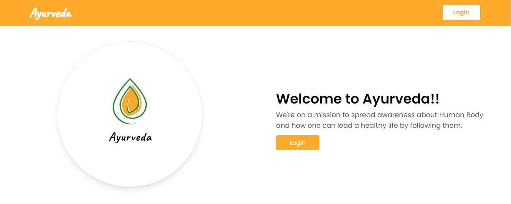

# Welcome to Ayurveda

We're on a mission to spread awareness about Human Body and how one can lead a healthy life by following them.

## What is Ayurveda?

Ayurveda, a natural system of medicine, originated in India more than 3,000 years ago. The term Ayurveda is derived from the Sanskrit words ayur (life) and veda (science or knowledge). Thus, Ayurveda translates to knowledge of life. Based on the idea that disease is due to an imbalance or stress in a person's consciousness, Ayurveda encourages certain lifestyle interventions and natural therapies to regain a balance between the body, mind, spirit, and the environment.

## Roadmap

- The user by default gets redirected to the **home page** of the site.

- After successfully registration / login, the user will get redirected to the dashboard of the site.

- Through dashboard user have to fill out the form shown in the modal. All the fields are mandatory to get the best results recommended and verified by the doctors.

## Tech Stack

## Contributors

